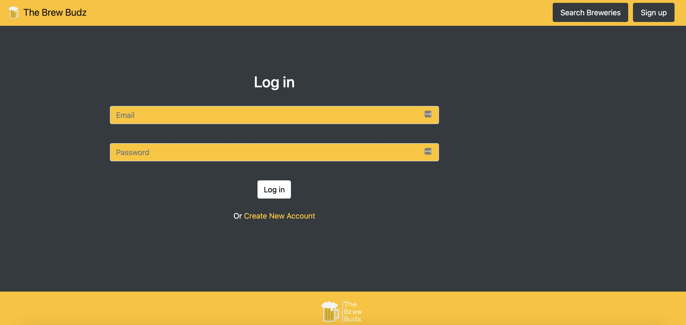
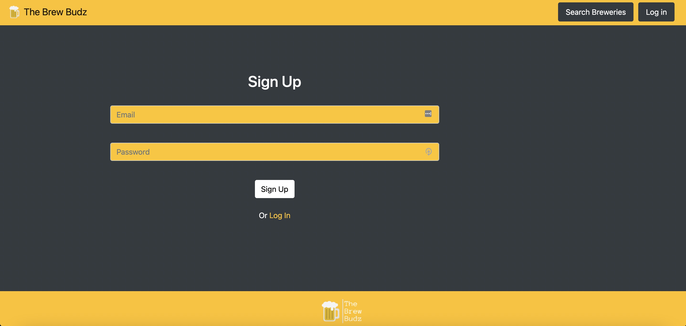
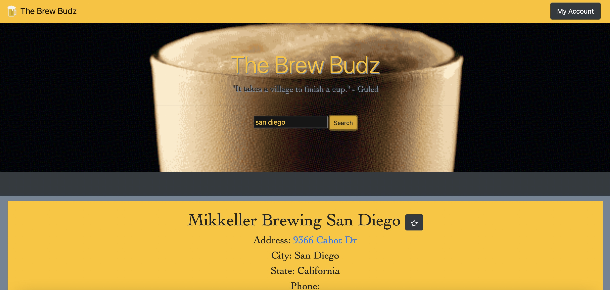

# The Brew Budz

## <a href="https://thebrewbudz.herokuapp.com/landing" target="_blank">Brew Budz on Heroku</a>

### "It takes a village to finish a cup." -Guled

### "Many hands make light work- after all, these kegs aren't going to tip over and pour themselves." -Anzel 

### "Save Water, Drink Beer." -Roman

### Beer Street 
#### "Beer, happy Product of our Isle 
#### can sinewy Strength impart, 
#### And wearied with Fatigue and Toil can chear each manly heart.
#### Labour and Art upheld by Thee 
#### Successfully advance, 
#### We quaff Thy balmy Juice with Glee
#### And Water leave to France.
#### Genius of Health, thy grateful Taste
#### Rivals the Cup of Jove, 
#### And warms each English generous Breast
#### With Liberty and Love."

## Come one, come all!

The Brew Budz is the newest way for beer lovers to discover the best breweries San Diego has to offer!  Search "San Diego" for a complete list of breweries in the San Diego area or, if you're looking for a specific spot, simply search the name! 

## Screenshots of application pages

### Landing Page


### Login Page


### Signup Page


### Beer Results Page


## GIF of Favorite Functionality
### Favorites may only be added/deleted if logged in/signed up. 


## Deployment

This app is configured for using GitHub with Travis CI for version control and CI. The project is ready for deployment on Heroku. A JawsDB instance must be provisioned for the Heroku app.

Add a `SERVER_SECRET` to the Heroku config for the app. (See [Configuration and Config Vars](https://devcenter.heroku.com/articles/config-vars) to learn how.)

## Running Locally

- Update username, password, and database fields in `/config/config.json` for local MySQL server connection.
- Create a `.env` file in the root folder of the project. The file must include the following:
  ```
  SERVER_SECRET = <your_secret_for_session_signing>
  ```
- Run `npm run watch` to start development server using nodemon.

## 